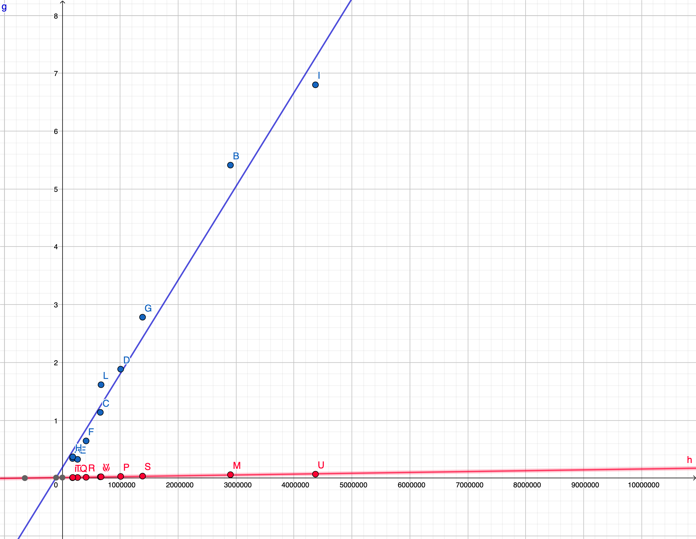
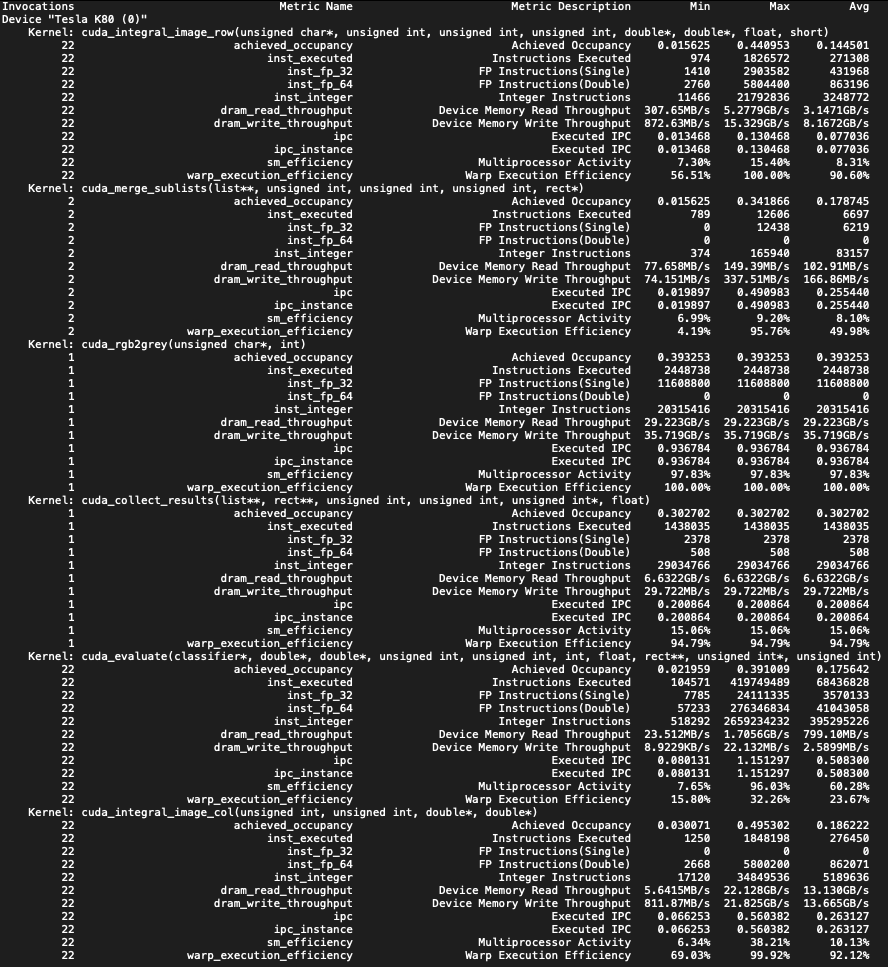

# CUDA Viola-Jones Face Detection

###### Implementation and comparison with sequential algorithm.

Vincenzo Lombardo - 978383,

January 5, 2022

------

### Abstract

This paper will illustrate the beneficts of CUDA on an algorthm like the Face Detection by Viola-Jones, which is one of the most famous and important algorthm for image analysis and Computer Vision applied in object detection, whose tasks offer various optimisation possibilities for parallelization. 

The aim of this paper is to briefly explain the concept of the algorithm, and illustrate the enhancements obtained with its parallel implementation on GPU respect to the classical sequential one on CPU. 

------

### Introduction

The Viola-Jones Face Detection algorithm, is one of the best known strategy for object detection tasks applied to images. It was proposed by Paul Viola and Michael Jones in 2001 in its generalized verson for object's detection. Two years later, they proposed a specific application for the task of face detection. 

This algorithm has become one of the foundations on this area of research, thanks to its innovative proposals in computation it can be implemented in real-time applications. 

Actually, its use in real-time applications became rather limited over the years, the size of images that devices produce increased exponentially, up to the point that this method resulted too slow compared to other new proposals (e.g. artificial intelligences, neural networks or convolutional networks). However, it was a great innovation because it was the first algorithm to be efficient enough to be applied for these purposes, and it is still used today in some fields (e.g. face detection in some cameras preview display).

The proposed CUDA implementation of the Face Detection algorithm demonstrates the enormous benefits of GPU computing in tasks such as these, showcasing the time speed-up that can be achieved.

------

### The algorithm

The Viola-Jones Face Detection algorithm is based on the evaluations of a sliding window on the greyscale image of the input image, applying a ***Cascade Classifier*** (CC) (or ADABoost classifier), which produces an output if there is a face within the current window. 

Classification with this model consists of several computation of *Weak Classifiers*, called ***Filters***. Each of them belongs to a stage, and is trained to recognize the presence of a specific *Haar-like feature*. The CC gives positive result if the current window passes all the analyses of the stages.

A ***stage*** of the CC calculates all the *Filters* it has, and finally compares the sum of the filters output with a *stage threshold*: if the stage output is negative, then the current window does not contain a face and stops the detection, avoiding the evaluation of the following stages. In short, if a stage rejects the window, the entire face detection in that window gives negative output. 

A **filter** basically is a *Weak Classifier*, which evaluates the presence of an *Haar-like feature* in the current window and returns its contribution to the stage computation. As its name explains, on its own is not sufficient to detect a face, but it can find some features that could belong to a face. The real accuracy of the CC comes the combination of the filters detections. 

An ***Haar-like feature*** is a composition of several pixel rectangles that can be distinguished as black or white areas. The combination in specific shapes and positions can be useful in detecting the presence of a face. For instance, the eyes can be detected as a black area with a white area on the top, that is the forehead.

<table>
  <tr>
    <td></td>
    <td></td>
  </tr>
</table>

In order to speed-up the computation of rectangular areas for the detection of *Haar-like feature*, the Viola-Jones algorithm uses the so-called ***Integral Image*** (II), that is a matrix of values in which a cell $(x,y)$ contains the sum of the pixels in the rectangular sub-region of the image starting at $(0,0)$ and ending at $(x,y)$. 

By pre-computing this Integral Image, the amount of calculation of the areas of the rectangle is significantly reduced compared to the naive approach, from the sum of all pixels in the rectangle to a simple sum of four values:

$$Area(R) = II(R.d) - II(R.c) - II(R.b) + II(R.a)$$

That was the key for its usage in real-time face detection. 

The calculation of the II offers that acceleration over the calculation of area when needed, but as explained, it depends very much on the size of the image to be evaluated. Due to the $O(\text{height} \cdot \text{width})$ complexity of the algorithm, with considerably large images its precomputation takes a prohibitive amount of time.

During the training of the *Cascade Classifier*, to improve accuracy, its filters used the variance calculation of the pixel values in the window they were evaluating to weight their thresholds. Thus, together with the *Integral Image*, another matrix called the ***Squared Integral Image*** is constructed, consistono of the squared pixels values, with the same properties of the II (to speed-up the variance calculation as well).

In order to use the *Cascade Classifier*, that was derivied from training on images $(24 \times 24)$, and detect faces at any scaling factor in the image, the original image is resized at various factors until the virtual window size is larger than the image, which is actually is when the resized image has one of the dimensions less than 24 pixels. That operation is called ***Image Pyramid*** creation.

------

### CUDA Implementation

The CUDA version of the Face Detection algorithm is developed based on the sequential version. The improvements are focused on those steps that are high parallelizable, which are basically most of the parts of the classification steps and the construction of the Integral Images.

In particular, the strategies used to find the tasks that can be parallelized consists of checking the steps of the algorithm with independent iterations, i.e. those with parallelization patterns (which in a matrix-based algorithm often occurs). For the sake of clarity, let us consider the general steps of the implemented Face Detection algorithm:

1. Read the input image;
2. If the input image is RGB, convert it to greyscale;
3. Load the classifier;
4. Compute the Image Pyramid: scale the image for each iteration;
   1. Construction of the Integral Image and the Squared Integral Image;
   2. Execution of the Cascade Classifier for each window in the image;
5. Retrieve the results.
6. Group the results to merge the similar ones;
7. Draw a bounding box for each result in the image;
8. Write the output.

As is obvious to notice, the steps that offers the greatest opportunities for parallelization are those in the 4., 5. and 2.; the last one because the greyscale conversion is applied independently pixel-wise. Each optimization step will be fully described later. 

#### Conversion from RGB to greyscale

The image format that the program can handle is the BitMap format, where the explicit definition of the pixels values does not require any particular decoding step. Because of its nature, reading this file allows the images to be loaded as matrices of pixels, so evaluation can be made with simple indexed access to the matrices.

The conversion of an image from an RGB (Red-Green-Blue) colour type to a greyscale one can be performed by applying the luminance formula:

$$grey(p) = 0.3 \cdot red(p) + 0.59 \cdot green(p) + 0.11 \cdot blue(p)$$
where $p$ is a pixel.

Considering that the greyscale value of a pixel is calculated with only its three colour components, the task can be performed by associating a CUDA thread to each pixel, resulting in a huge improvement in terms of calculation time.

#### Computation of the Image Pyramid

In the sequential version a simple loop is used for each iteration, within which the scaling factor is derived and the tasks are executed. For purpose of parallelization, it should be noted that each iteration (which we recall consists of constructing the Integral Images, applying the classifier and retreiving the results) is independent from the others. This makes this phase the ideal scenario for applying the potential offered by CUDA.

By introducing *Dynamic Parallelism* we are able to execute the kernels of each iteration at the same time, this leads to the reduction of the total time of this phase to the time required by the single first iteration, which is, of course, the longes, as it is the one with the lowest scaling factor. Considering that the *Dynamic Parallelism* allows the execution of up to 32 task queues, we have the possibility of executing up to 32 algorithm iterations at the same time. In order to handle input images that needs more than 32 iterations (a difficult case due to the size required to reach this limit), the flow assigned to each of them is obtained by $iteration \mod{32}$.

In any case, the parallel algorithm provides only the streams that are needed for the execution: they are defined as an array of *CudaStream*, and the size of this array depends on the number of iterations needed, that can be calculated a-priori by the following formula:

$$ iterations = \left\lfloor \frac {\log(\frac{maxWindow}{24})} {\log(factor)} \right\rfloor $$

$$ streams = \min (iterations,  32 ) $$

#### Build of the Integral Image and Squared Integral Image

In the proposed implementation, the image resizing for the Image Pyramid construction is not done explicitly, it is done indirectly during the Integral Image construction step: the pixel value reading is done with a Nearest Neighborhood strategy by computing the pixel coordinates in the image in the image from the coordinates of the current cell in the Integral Images scaled by the resizing factor of the current iteration. With this appoach, there is no need to instantiate a new image just to calculate the integral images (note: this happens in both sequential and parallel versions).

In the sequential algorithm, Integral and Squared Integral Images are constructed using a  dynamic programming approach:

$$ II(x,y) = II(x-1,y) + II(x,y-1) + p(x,y) $$

$$ SqII(x,y) = II(x-1,y) + II(x,y-1) + p(x,y)^2 $$

where $II$ is the Integral Image, $SqII$ is the Squared Integral Image and $p$ is the image. This solution creates the integral images in a quadratic time. 

The parallel version of this algorithm attempts to make the calculation as independent as possible by dividing the task in two phases: a cumulative sum along the rows of the image pixel values, and then the cumulative sum along the columns of the values previously obtained. The two CUDA kernels can therefore be defined to map one thread per row for the first phase, and on thread per column for the second phase.

By these, the final matrices contain the correct values of the integral images. The time cost of the task decreases from $O(\text{height} \cdot \text{width})$ of the sequential version, to $O(\text{height} + \text{width})$.

<table>
  <tr>
    <td></td>
    <td></td>
  </tr>
</table>

The two phases are implemented as different kernels because the second phase only needs to be executed when the first is complete, so a grid synchronization was necessary and waiting for the end of the kernel was the only way (for CUDA versions prior to 9).

#### Execution of the Cascade Classifier

In the sequential algorithm the classifier is executed for each pixel, whose coordinates define the position of the window in that iteration. Then, for each window, the variance of the pixel values within is calculated, and the classifier is executed, which evaluates its stages by calculating the filters until an output is produced. 

The parallel algorithm considers the fact that each window evaluation essentially is independent from the others, then the classifier can be executed at the same time for each possible window of the image. In shorts, each CUDA thread is mapped to a pixel of the image, which corresponds to a window; it calculates the variance and runs the classifier.  

#### Retrieve of the results

One small difference between the versions is how the results are handled: 

* In the sequential there is a linked list, and whenever the classifier produces positive results the coordinates of the current pixel, together with the size of the window, are stored in the list; 
* In the parallel there is a matrix of pointers to the result data structure (`Rectangle`) of the same size as the input image; that was mandatory to make the classifier evaluations completely independent, because any other data structure such as the linked list of the sequential version would have problems due to synchronisation between threads; with the results matrix each thread will store the result data by accessing it with the coordinates scaled those of the current resized image (this might cause overwriting of data between neightbouring threads but it is assumed that they would find the same face in the image).

It is obvious that in the sequential version the results of executing the the classifier are already stored in the linked list, but in the parallel version, due to the results matrix and the fact that they are in the memory of the GPU, obtaining the results is a more complex task to accomplish. The only way to copy a data structure from the device memory is through an array of that type, but it must be constructed from a sparse matrix of pointers.

The solution implemented for this problem is divided into two phases:

1. Collect all results from the matrix by visiting it along the rows, similar to the first phase of Integral images construction; the found results are moved into a linked list, so we need to define an array of linked list pointers of size #height to have a list for each executed thread. The goal of this first phase is to move from a 2D to a 1D results structure, and is achieved by a CUDA kernel with threads mapped to the rows;

2. Once the results are stored in an array of linked lists, we need to merge them all into a single list placed at the first item of the list. Since we are dealing with a small number of results located in different areas of the image, not all the items of the array will contain a list with the results, so we need a fast algorithm to merge all the items of an array into one. Such an algorithm can be an adapted version of ***binary reduction***, which completes the task in logarithmic time instead of the linear time of a sequential visit. 

   The original *binary reduction* algorithm divides the computation along the thread blocks, and merges only the items that belong to them into one that is the first item of each block. Considering the goal here, which is not to reduce the number of lists but to merge them all, the algorithm is adapted to be called several times until the number is low enough to be computed by a single block that completes the merge in a single unique list with all results in it. Once the lists are merged into one, the results are copied into an array in order to allow the memory to be copied from the device to the host.

------

### Comparison and Metrics

As mentioned in the introduction, the results of the CUDA version compared to the sequential version are excellents. This demonstrates that the possibilities for this area of research are several, and the GP-GPU (General Purpose GPU) paradigm can lead to new opportunities. 

Below there are some tests of execution with different inputs. For these benchmarks, the used GPU was an NVIDIA Quadro P6000.

| Size $(w\times h)$ | Pixels    | GPU time (sec) | CPU time (sec) |
| ------------------ | :-------- | -------------- | -------------- |
| (2100×1382)        | 2.902.200 | 0.058746       | 5.412070       |
| (550  ×320)        | 176.000   | 0.006497       | 0.339265       |
| (1024 × 640)       | 655.360   | 0.021368       | 1.136644       |
| (1229 × 819)       | 1.006.551 | 0.028592       | 1.884092       |
| (512 × 512)        | 262.144   | 0.009930       | 0.324125       |
| (640 × 640)        | 409.600   | 0.013789       | 0.642754       |
| (1300 × 1065)      | 1.384.500 | 0.034143       | 2.782335       |
| (640 × 280)        | 179.200   | 0.011018       | 0.367113       |
| (2560 × 1707)      | 4.369.920 | 0.067517       | 6.800974       |
| (1000 × 668)       | 668.000   | 0.023232       | 1.614393       |

The following image is an approximation of the time cost functions obtained through linear regression, using the statistics from the previous table. The graph shows as blue line and points the CPU time function and its data, and as red line and points the GPU time function and its data. The $y$ axis corresponds to time, while the $x$ axis is the input size expressed as the total number of pixels to be evaluated.

------

### Profiling

Thanks to the CUDA tool `nvprof` we are able to analyse the behaviour of kernels in the CUDA version. The following statistics are taken from an execution of the algorithm with an NVIDIA Tesla K80, provided by Google Colaboratory, and an input image of size $(2100×1382)$. 

As can be observed, most of the kernels reaches a very high value for the warp execution efficiency. The only kernel that is less optimized than the others is `cuda_evaluate` because of high window rejection rate that CUDA threads can achieve, which means that few kernels actually complete the classification by executing all the stages, causing inefficiency from a warps execution perspective.

------

### Conclusions

This implementation of Viola-Jones Face Detection has not reached its best optimized version, because several improvements can still be made, for example the use of different device memories to reduce access latency such as Constant Memory for the classifier data, and Texture Memory for the greyscale image, which is often read.   

However, this Viola-Jones Face Detection demonstated the power of GPU computing and the possibilities with GP-GPU applied to optimising and parallelising of a sequential algorithm. NVIDIA CUDA provides various tools and APIs, thanks to the years spent on this research field, to improve an existing algorithm by using the GPU as a high-powered co-processor that can be used to execute heavy tasks while the CPU works on others. 

------

### References

1. Paul Viola, Michael Jones. **Robust Real-time Object Detection**, http://citeseerx.ist.psu.edu/viewdoc/summary?doi=10.1.1.110.4868, July 13, 2001;
2. Zhenyu Ye, Francesco Tomarchi, **Viola-Jones Face Detection**, https://sites.google.com/site/5kk73gpu2012/assignment/viola-jones-face-detection, 2012;
3. Imene Guerfi, Lobna Kriaa and Leila Azouz Saidane, **An Efficient GPGPU based Implementation of Face Detection Algorithm using Skin Color Pre-treatment**, https://www.scitepress.org/Papers/2020/98333/98333.pdf;
4. Su Wu, Pu Li, **Multi-Core Architectures and Programming: Viola-Jones with CUDA**, https://www12.informatik.uni-erlangen.de/edu/map/ss15/talks/vj_cuda.pdf.

------

A special thanks to <a href="https://github.com/giuseppe16180">Giuseppe Marino</a> and <a href="https://github.com/manuelpagliuca">Manuel Pagliuca</a> for helping me review this paper.
